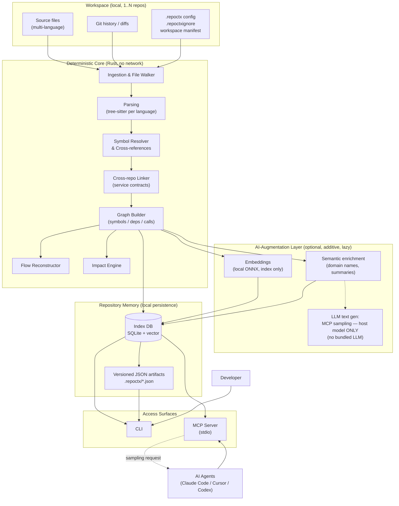
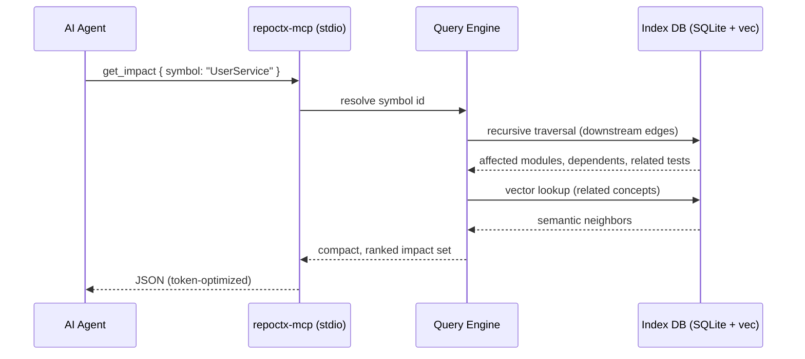
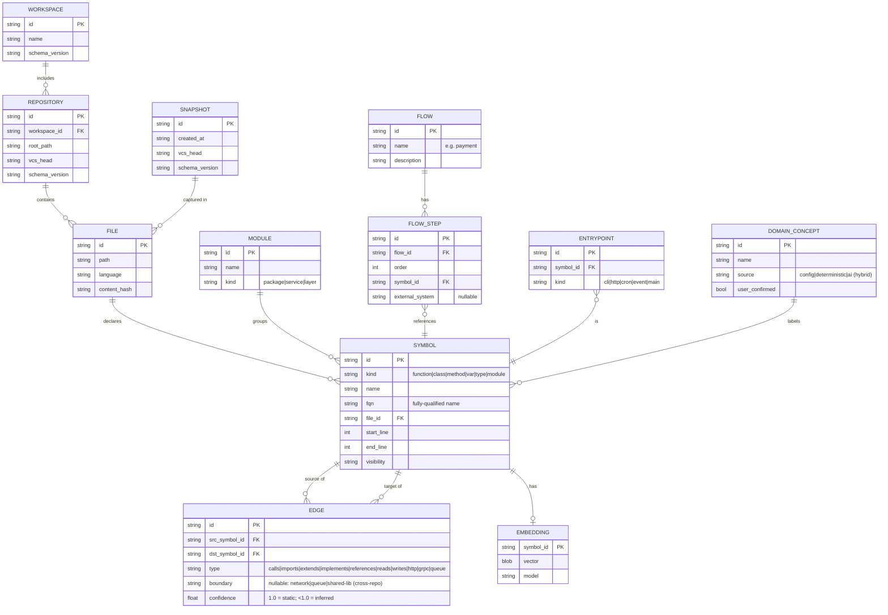
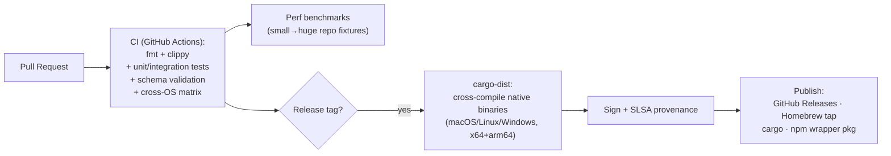

# RepoCtx — Architecture (Agreed v1.0)

> Status: **AGREED — source of truth for implementation.** All decisions locked (see §9).
> Architectural style: **local-first, deterministic-core, AI-augmented, agent-agnostic**.
> License target: **Apache-2.0** (permissive + explicit patent grant).
>
> **Decisions locked in this revision**
> - **Rust-first core** — chosen for the "small-to-huge repo" range, lowest-possible latency, and
>   best-tool-regardless-of-team-size directive.
> - **Multi-language** via tree-sitter, language support as plugins.
> - **Multi-repo / workspace** model is first-class (cross-repo flow resolution).
> - **LLM enrichment is host-delegated only** via **MCP sampling** (uses the agent's own model, e.g.
>   Cursor / Claude Code) — **no bundled LLM, no Ollama, no remote provider, no API keys**. Embeddings
>   use one small local ONNX model (index only). Enrichment is lazy and optional.
> - **Zero telemetry. No cloud, no team-sync** — purely local.
> - Cross-service boundaries: **static + heuristic + AI inference** (no runtime tracing in v1).
> - **Zero-config by default**: domains/flows auto-discovered; refinement via CLI, optional `repoctx.toml`.

---

## 1. High-Level Overview

RepoCtx is a **local intelligence layer** for codebases. It ingests a repository, builds a
deterministic structural model (symbols, dependencies, flows, entry points), persists it as a
versioned, machine-readable store, and exposes it to humans and AI agents through three surfaces:

1. A **CLI** (`repoctx build | impact | flow | context`).
2. A set of **versioned JSON artifacts** under `.repoctx/`.
3. An **MCP server** (`repoctx-mcp`) speaking JSON-RPC over stdio.

The system is organized in layers, each with a single responsibility and a stable internal contract:



**Design tenets enforced by this structure**
- The **Deterministic Core never touches the network**. Reproducibility and privacy are structural, not configurable.
- The **AI-Augmentation Layer is strictly additive**: removing it degrades quality (fewer human-friendly names/summaries) but never breaks structural correctness.
- The **artifacts (`.repoctx/*.json`) are the public contract**; the index DB is an internal, rebuildable cache.

---

## 2. Tech Stack

The driving requirements — support **every language possible**, scale from **tiny to truly enormous**
repos, deliver the **lowest possible latency**, and pick the **best technology regardless of team
size** — point decisively to a **Rust-first** implementation. Rust gives native speed, predictable
low-latency memory behavior (no GC pauses on huge graphs), fearless parallelism, and single-binary
distribution, while still integrating cleanly with the AI ecosystem.

### Chosen stack

| Layer | Choice | Rationale |
|---|---|---|
| **Core, CLI & MCP server** | **Rust** (CLI via `clap`, MCP via the official **Rust MCP SDK** / `rmcp`) | One language end-to-end; native performance for the small→huge range; lowest latency; single static binary, easy distribution. |
| **Parsing** | **tree-sitter** (native Rust bindings) | Incremental, error-tolerant parsers for dozens of languages; the de-facto standard for multi-language tooling; deterministic. |
| **Language support** | **Plugin model** — one grammar + extraction ruleset per language, loaded from a registry | "As many languages as possible" without a monolith; community can add languages; ships a curated core set first. |
| **Index / Memory DB** | **SQLite** (`rusqlite`) with **recursive CTEs** for graph traversal | Embedded, zero-config, transactional, extremely fast locally; recursive CTEs cover impact/flow traversal. |
| **Vector store** | **`sqlite-vec`** (same SQLite file) | Single embedded file, no extra service; aligns with local-first. |
| **Embeddings** | **Bundled local ONNX model** via `ort` (+ `fastembed-rs`), small (e.g. BGE-small, ~100 MB) | The *only* model RepoCtx ships. Runs in-process, offline, deterministic — **not** a server/daemon and **not** Ollama. Downloaded once on first build, then cached. License verified Apache-2.0/MIT. |
| **LLM text enrichment** | **Exclusively host-delegated via MCP sampling** (Cursor / Claude Code / Codex model) | No bundled LLM, **no Ollama, no remote provider, no API keys**. If no MCP host is present, text enrichment is simply skipped — deterministic output is unaffected. |
| **Artifact schemas** | **JSON Schema** + generated types, explicit `schemaVersion` | Output is a versioned public contract; schemas are testable and self-documenting. |
| **Distribution** | **Native signed binaries** via `cargo-dist` (GitHub Releases) + **Homebrew tap** + `cargo install` + a **thin npm wrapper** that fetches the right binary | Best reach: `brew`/`cargo` for native users, `npx repoctx` for JS devs — same pattern as ripgrep, ast-grep, biome, swc. |

> **Graph storage note:** we start with SQLite + recursive CTEs (simplest, fully embedded). If traversal
> depth/latency on enormous monorepos becomes a bottleneck, an embedded graph engine
> (e.g. **KùzuDB**, Cypher) is the pre-vetted upgrade path — same local-first footprint.

### How AI works (final decision)
RepoCtx uses **two clearly separated kinds of "AI", and never bundles an LLM**:

1. **Embeddings (local, deterministic):** a single small ONNX model runs in-process to vectorize
   symbols for semantic search. This is an index, not a chatbot — no daemon, no Ollama, no network.
2. **LLM text generation (host-delegated only):** human-friendly domain names and summaries are
   produced **exclusively via MCP sampling** — i.e. the model already running in the host agent
   (Cursor, Claude Code, Codex). RepoCtx holds **no keys, no Ollama, no remote provider**.

**Enrichment is opportunistic & lazy.** `repoctx build` always produces the full deterministic
structure (and embeddings) with **no model required**. LLM naming/summaries are computed **on demand**
the first time a symbol/flow is accessed through an MCP host that supports sampling, then **cached** in
the store so the cost is paid once. Without a host model, RepoCtx falls back to deterministic names
(module/folder/symbol-derived) — fully functional, just less prose.

### Explicitly *not* needed
No managed cloud database, no Kubernetes, no always-on web backend, **no team-sync / cloud component**,
**no telemetry**. The product is strictly local.

---

## 3. System Architecture

### 3.1 Build pipeline (data flow on `repoctx build`)

```mermaid
flowchart LR
    A["Walk files\n(respect .repoctxignore)"] --> B["Hash files\n(content + mtime)"]
    B --> C{"Changed\nsince last run?"}
    C -- "no" --> R["Reuse cached\nparse/graph"]
    C -- "yes" --> D["Parse with tree-sitter"]
    D --> E["Extract symbols\n(funcs, classes, methods, vars)"]
    E --> F["Resolve references\n(imports/calls/extends)"]
    F --> X["Cross-repo link\n(service contracts)"]
    X --> G["Build graphs\nsymbol / dependency / call"]
    R --> G
    G --> H["Reconstruct flows\n+ detect entry points"]
    H --> EMB2["Embeddings (local ONNX)\n+ deterministic names"]
    EMB2 --> J["Persist to Index DB"]
    J --> K["Emit versioned JSON\n.repoctx/*.json"]
    J -. "lazy, on query via MCP host" .-> LLM["LLM names/summaries\n(MCP sampling) → cached"]
```



> Note: `build` never needs a model. LLM-authored names/summaries are filled in **lazily** the first
> time an MCP host with sampling accesses them, then cached.

### 3.2 Query path (e.g. agent calls `get_impact`)



### 3.3 Component responsibilities

- **Ingestion & Walker** — discovers files, applies ignore rules, computes content hashes for incremental builds.
- **Parser** — tree-sitter per language; tolerant to syntax errors; emits normalized AST/CST nodes.
- **Resolver** — links references across files (imports, calls, inheritance), producing typed edges.
- **Cross-repo Linker** — links symbols *across repos* in a workspace via service contracts (HTTP/gRPC client↔server, shared package names, OpenAPI/proto, message-queue topics). See §3.4.
- **Graph Builder** — materializes three logical graphs (symbol graph, dependency graph, call graph).
- **Flow Reconstructor** — stitches call/data paths into business flows; flags external-system & cross-repo boundaries.
- **Impact Engine** — forward/backward reachability over edges; correlates tests and risk zones; traverses across repos.
- **AI-Augmentation** — embeddings + optional LLM naming/summarization (via MCP sampling or local model); always reversible and additive.
- **Repository Memory** — SQLite index (rebuildable cache) + JSON artifacts (stable, versioned output).
- **Access Surfaces** — CLI and MCP server share one Query Engine; no logic is duplicated.

### 3.4 Multi-repo / workspace model

A **workspace** is a manifest listing one or more local repositories that belong to the same logical
project (e.g. several microservices). Analysis runs per-repo (so each repo keeps its own `.repoctx/`),
then the **Cross-repo Linker** stitches a unified graph using deterministic **service contracts**:

- HTTP/REST: match client call sites (URL + verb) to server route declarations.
- gRPC / Protobuf & OpenAPI: shared service/message definitions resolve client↔server edges.
- Messaging: producers/consumers matched by topic/queue name.
- Shared libraries: same package coordinates across repos.

Cross-repo edges are tagged `boundary = network|queue|shared-lib` and `confidence` (since dynamic
endpoints are inferred). This lets `flow payment` span repos and `impact` propagate across service
boundaries. Single-repo usage is just a workspace of size 1 — no special-casing.

---

## 4. Data Model

The model is **graph-shaped** (nodes + typed edges), stored relationally in SQLite and exported as JSON.



### Artifact mapping (`.repoctx/`)
| File | Backed by | Purpose |
|---|---|---|
| `architecture.json` | MODULE + layer/edge summary | High-level structural map |
| `symbols.json` | SYMBOL | Symbol catalog with locations & FQNs |
| `dependencies.json` | EDGE (imports/calls) | Dependency graph |
| `flows.json` | FLOW + FLOW_STEP | Reconstructed business flows |
| `entrypoints.json` | ENTRYPOINT | Detected entry points |

> Every artifact embeds `schemaVersion`. Schema changes follow **semantic versioning**; breaking
> changes bump the major and ship a migration note. The `source`/`confidence` fields distinguish
> deterministic facts from AI-inferred enrichment so consumers can trust/weight accordingly.

### Domains & flows: zero-config first (final decision)
Simplicity is a hard requirement: **the tool must work with no configuration file at all.** A domain
(e.g. `payment`) is resolved in this order:

1. **Auto-discovery (default, zero-config):** deterministic signals — module/folder names, call-graph
   clustering, entry-point grouping — plus embedding similarity, propose domains automatically. Names
   are deterministic by default and upgraded to nicer prose lazily via MCP sampling when available.
   `repoctx build` + `repoctx flow payment` just works on a fresh repo.
2. **CLI refinement (no hand-written syntax):** if a guess is wrong, the developer fixes it with a
   command, persisted in the store — *not* a config file to author:
   ```
   repoctx domain rename <auto-id> payment
   repoctx domain add payment src/billing/** PaymentService
   ```
3. **Optional `repoctx.toml` (power users only):** a single, tiny, fully-optional file for teams that
   want domain definitions version-controlled. Never required; the tool is fully functional without it.

So: **zero config to start, CLI to refine, optional file only if you want it in Git.** No mandatory or
"strange" configuration.

---

## 5. API Design

RepoCtx is **not** a REST/GraphQL service in v1 — being local-first, its "API" is three coordinated contracts:

### 5.1 CLI contract
Verb-based, scriptable, machine-friendly. Every command supports `--json` for stable structured output and non-zero exit codes on failure.
```
repoctx build [--incremental] [--no-embeddings] [--watch]
repoctx impact <symbol>   [--depth N] [--json]
repoctx flow   <domain>   [--json]
repoctx context <symbol>  [--budget <tokens>] [--json]
repoctx domain  rename <auto-id> <name>        # zero-config refinement, persisted in the store
repoctx domain  add    <name> <path|symbol>... # no hand-written config file required
```

### 5.2 MCP contract (primary agent interface)
JSON-RPC 2.0 over **stdio** (local, no open port by default). Tools mirror the README:

| Tool | Input | Output (token-optimized) |
|---|---|---|
| `get_context` | `{ symbol, budget? }` | responsibility, related components, external deps, invariants |
| `get_impact` | `{ symbol, depth? }` | affected modules, downstream deps, related tests, risk zones |
| `get_flow` | `{ domain }` | end-to-end path, service interactions, external systems |
| `get_dependencies` | `{ symbol, direction? }` | direct/transitive dependencies |

The server also declares the **`sampling` client capability**: when enrichment needs an LLM, it issues
a sampling request so the **host agent's model** (e.g. Cursor) runs the completion — no embedded keys.

### 5.3 Artifact contract
The `.repoctx/*.json` files are a **read API for any tool**, versioned via `schemaVersion`. This makes RepoCtx consumable even without running its process (CI checks, dashboards, other agents).

**Why this paradigm:** the consumers are local processes and agents on the same machine. stdio MCP +
files give zero network surface, zero auth complexity, and trivial composability. A **local HTTP/gRPC
server is deliberately out of scope for v1** and only revisited if a remote/team mode is approved.

---

## 6. Infrastructure & Deployment

Because the runtime is the developer's machine, "infrastructure" means **build, packaging, distribution, and CI** — not server hosting.



- **CI/CD**: GitHub Actions, matrix over macOS/Linux/Windows (x64 + arm64). Gates: `cargo fmt`, `clippy`, tests, **JSON Schema validation**, and **determinism tests** (same fixture → byte-identical artifacts). Performance benchmarks guard against latency regressions on large-repo fixtures.
- **Distribution** (best reach for an OSS standard): signed **native binaries** via `cargo-dist` on GitHub Releases, a **Homebrew tap**, `cargo install repoctx`, and a **thin npm wrapper** (`npx repoctx`) that downloads the matching prebuilt binary — the same model used by ripgrep, ast-grep, biome and swc.
- **Versioning**: release-please / conventional commits; the artifact `schemaVersion` is versioned **independently** from the CLI version.
- **No cloud to operate.** There is **no team-sync, no backend, zero telemetry, and no outbound LLM traffic from RepoCtx** — any LLM call is executed by the host agent via MCP sampling, not by RepoCtx.

---

## 7. Security & Authentication

The asset under protection is **the source code itself** (often the user's most sensitive IP) plus any secrets embedded in it.

**Data handling & privacy**
- **Local-first by construction**: the deterministic core has no network access; nothing leaves the machine.
- **Zero telemetry** — no analytics, no usage collection, no "phone home", ever (per PO directive).
- **`.repoctxignore`**: excludes paths (e.g. `.env`, vendored dirs) from analysis entirely.
- **Secret redaction**: before *any* LLM interaction (including MCP sampling), run secret-scanning/redaction (API keys, tokens) so secrets are never transmitted.

**AI boundary (the main exfiltration risk)**
- RepoCtx **bundles no LLM and integrates no remote provider** — there is no API key to leak and no outbound LLM call originating from RepoCtx.
- LLM text generation happens **only via MCP sampling**, executed by the host agent (e.g. Cursor) over the existing stdio channel. RepoCtx opens no new connection.
- The bundled embedding model is **local and in-process** (no daemon, no network).
- Before content is handed to a sampling request, **secret-scanning/redaction** runs so secrets are never included.

**Access control**
- **No auth needed**: the trust boundary is the local OS user. MCP runs over **stdio (no listening port)**, so there is no remote attack surface, and there is no network/team component to secure.

**Supply-chain & integrity**
- Signed releases + SLSA provenance; `Cargo.lock` committed + `cargo audit`/`cargo deny` in CI.
- Parsing runs on untrusted code but is **non-executing** (tree-sitter parses, never evaluates), avoiding code-execution risk during analysis.

---

## 8. Licensing & Open Source

- **License: Apache-2.0.** Permissive (maximizes adoption — essential to the "become the standard like
  Git" goal) and, unlike MIT, includes an **explicit patent grant** protecting users and contributors.
- **Dependency hygiene:** prefer Apache-2.0/MIT/BSD dependencies. **Verify the embedding model's
  license** (e.g. BGE family) is compatible before bundling; otherwise ship it as a separately
  downloaded artifact.
- **Governance (future):** clear `CONTRIBUTING`, a language-plugin contribution guide, and semantic
  versioning of both the CLI and the artifact `schemaVersion` to keep the ecosystem stable.

---

## 9. Final Decisions (all locked — ready for development)

Every decision below is settled; there are **no open questions** blocking development.

| # | Topic | Decision |
|---|---|---|
| 1 | Language | **Rust** end-to-end (core, CLI, MCP). |
| 2 | Multi-language | **tree-sitter**, plugin per language. First-class set at launch: **TypeScript/JavaScript, Python, Go, Java, Rust**; more added as plugins. |
| 3 | Scale & latency | Designed for small→huge repos. **Target budgets** (enforced by CI benchmarks): incremental rebuild of a changed file **< 200 ms**; query (`impact`/`flow`/`context`) **p95 < 100 ms** on a warm index; cold full build streamed with progress. |
| 4 | Storage | **SQLite** (`rusqlite`) + recursive CTEs; **`sqlite-vec`** for vectors; single embedded file. |
| 5 | Embeddings | One **bundled local ONNX model** (BGE-small class, ~100 MB), downloaded on first build & cached. In-process, offline, deterministic. `--no-embeddings` opt-out. |
| 6 | LLM enrichment | **Host-delegated via MCP sampling only** (Cursor/Claude Code/Codex). **No bundled LLM, no Ollama, no remote provider, no keys.** Lazy + cached; build never needs a model. |
| 7 | Multi-repo | **First-class workspace** model; cross-repo linking via service contracts (HTTP/gRPC/proto/OpenAPI/queues/shared libs). Single-repo = workspace of 1. |
| 8 | Workspace discovery | **Auto-detect** git repos under the working root (zero-config); optional `repoctx.toml` to override — never required. |
| 9 | Domains/flows | **Zero-config auto-discovery** by default; refine via **CLI commands** (persisted in store); optional tiny `repoctx.toml` only for version-controlled definitions. |
| 10 | Cross-service | **Static + heuristic + AI inference**, edges tagged with `confidence`. No runtime tracing in v1. |
| 11 | Telemetry | **Zero. None. Ever.** |
| 12 | Cloud / team | **None** — strictly local. |
| 13 | License | **Apache-2.0**; dependencies & embedding model kept license-compatible. |
| 14 | Distribution | **Homebrew** + **npm wrapper** (`npx repoctx`) as the two primary channels; also signed GitHub Release binaries (`cargo-dist`) and `cargo install`. |
| 15 | Platforms | **macOS & Linux tier-1** (x64 + arm64, fully CI-tested); **Windows tier-2** (supported & CI-built, issues triaged after tier-1). |
| 16 | Artifact schema | JSON Schema with `schemaVersion`, SemVer'd independently from the CLI. |

This document is now the **agreed source of truth**. Implementation can begin against it.
