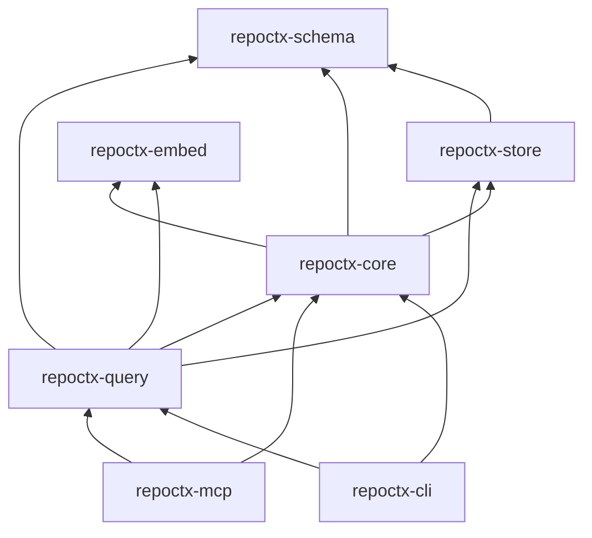

# CODEMAP.md — RepoCtx execution map

> Come scorre l'esecuzione end-to-end. Aggiornare quando si aggiungono route, job o crate.

---

## Binari

| Binario | Crate | Ruolo |
|---|---|---|
| `repoctx` | `repoctx-cli` | CLI developer-facing |
| `repoctx-mcp` | `repoctx-mcp` | MCP stdio (`get_context`, `get_wiki`, `get_impact`, `get_flow`, `get_dependencies`) |

---

## `repoctx build`

```
repoctx-cli::main
  └─ commands::execute(Build | Workspace | Wiki)
       └─ repoctx-core::BuildPipeline::run  (single repo)
       └─ repoctx-core::WorkspacePipeline::run  (multi-repo)
            ├─ BuildPipeline per ogni membro
            ├─ CrossRepoLinker (HTTP / gRPC / queue)
            └─ ArtifactWriter → .repoctx/cross_repo.json
```

### `repoctx build` (singolo repo)

```
repoctx-cli::main
  └─ commands::execute(Build)
       └─ repoctx-core::BuildPipeline::run
            ├─ FileWalker::discover
            ├─ TreeSitterParser::parse_file
            ├─ IndexStore::delete_symbols_for_path  (incremental)
            ├─ GraphResolver::resolve_calls
            ├─ FlowReconstructor::reconstruct
            ├─ index_entrypoints
            ├─ index_symbol_embeddings (optional)
            ├─ IndexStore::export_artifacts
            ├─ ArtifactWriter::write_artifact × 5
            ├─ WikiCompiler::compile_all
            └─ WikiLinter::run
                 → .repoctx/*.json + wiki/*.md + wiki_lint.json + wiki_stale.json
                 + .repoctx/index.db
```

---

## Query commands

```
repoctx-cli::commands::execute
  └─ repoctx-query::QueryEngine
       ├─ impact / flow / dependencies
       └─ context → assemble_context
```

### `repoctx context` (Context Assembly)

```
repoctx-query::assemble_context(symbol, budget, task)
  ├─ resolve callers / callees / impact (graph BFS)
  ├─ semantic_neighbor_ids (sqlite-vec, when embeddings indexed)
  ├─ rank: root → callers → callees → semantic → affected
  ├─ slice source snippets from disk (greedy pack to budget)
  ├─ find_page_for_symbol → sanitize_for_context (wiki)
  └─ render markdown bundle
```

### `repoctx wiki`

```
repoctx-cli::wiki {sync|lint|show}
  ├─ sync → WikiCompiler::sync_pages (selective or --all; preserves enriched prose)
  ├─ lint → WikiLinter::run → wiki_lint.json + wiki_stale.json
  └─ show  → WikiStore::load_page / resolve by title or stem
```

---

## MCP (`repoctx-mcp`)

```
repoctx-mcp::main (tokio)
  └─ server::serve(stdio)
       └─ RepoCtxMcpServer (rmcp tool_router)
            ├─ get_context  → QueryEngine::context (+ optional sampling enrichment)
            ├─ get_wiki     → WikiStore + optional enrich_wiki_prose (persists .md)
            ├─ get_impact   → QueryEngine::impact
            ├─ get_flow     → QueryEngine::flow (+ optional sampling)
            └─ get_dependencies → QueryEngine::dependencies
```

Env: `REPOCTX_ROOT` (default: cwd). Richiede `repoctx build` prima.

---

## Dipendenze tra crate



---

## File system output

```
<repo-root>/
  .repoctx/
    index.db
    architecture.json
    symbols.json
    dependencies.json
    flows.json
    entrypoints.json
    wiki_lint.json
    wiki_stale.json
    wiki/
      index.md
      *.md
```
